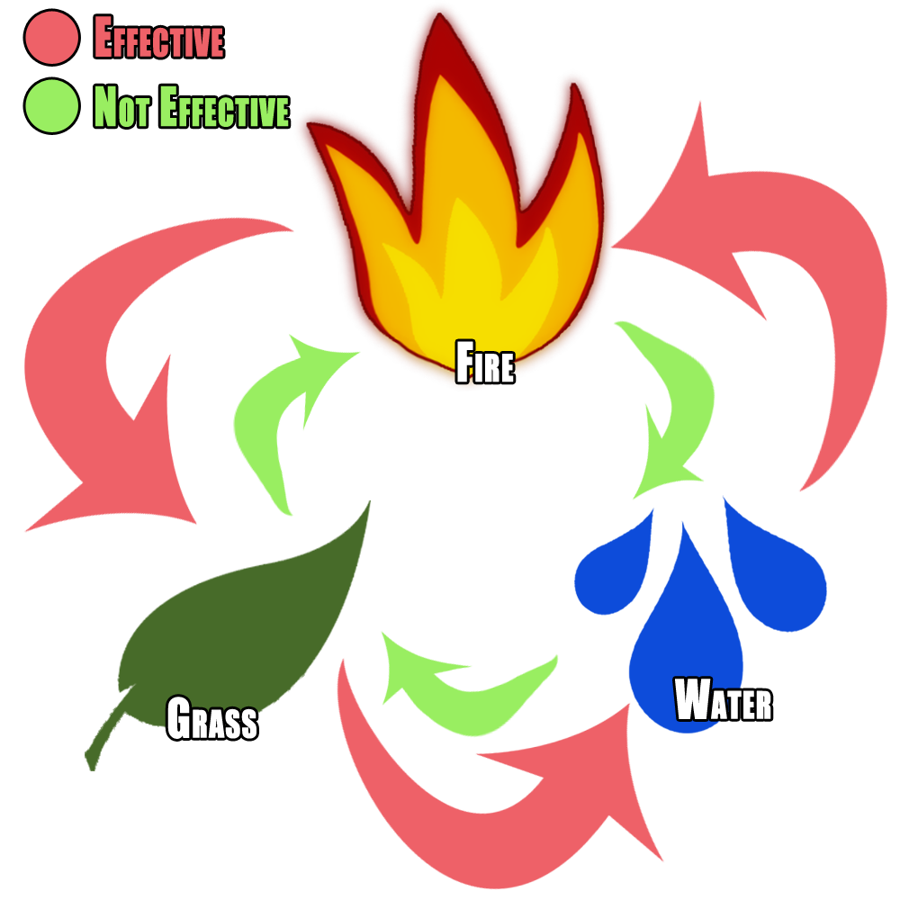

# Neuromon

A Pokémon-esque battle simulator with an AI developed using neuro-evolution.

---

This project was created to explore the possibility of using neuro-evolution to produce artificial intelligence capable of non-deterministic game-playing. It uses a branch of neuro-evolution named *Neuro-Evolution of Augmenting Topologies* (NEAT) and a .NET implementation of the algorithm named [SharpNEAT](https://github.com/colgreen/sharpneat). The project consists of two main components: Neuromon and a Training GUI.

### Neuromon

Neuromon is a turn-based game in which two players battle to defeat their opponent's Neuromon. A Neuromon has a selection of four moves which they can attack with. On a player's turn, they may choose to either attack with their active Neuromon or switch to another Neuromon in their collection. Additionally, each Neuromon and move has a particular type. Each type is effective or weak against certain other types:

Neuromon has four player implementations:

- **Human**: Controlled via keyboard input
- **Random**: An AI which makes random decisions
- **Intelligent**: An AI which knows effective game strategy, however occasionally makes mistakes
- **NEAT**: An AI developed through neuro-evolution. This type of player required a 'brain' file, which is an `xml` file representing the neural network

At current, there exists a console application of Neuromon in `Game.Console`. It has various configuration settings which are set in `GameSettings.json`.

##### Game Settings
These settings alter various aspects of the game:

- **Number of Neuromon**: How many Neuromon each player has
- **Effective Multiplier**: The multiplier applied when a move's type is effective against the target Neuromon's type
- **Weak Multiplier**: The multiplier applied when a move's type is weak against the target Neuromon's type
- **Minimum Random Multiplier**: The minimum random multiplier that is applied when calculating damage
- **Maximum Random Multiplier**: The maximum random multiplier that is applied when calculating damage
- **Types File Name**: The relative path to the types `JSON` file
- **Moves File Name**: The relative path to the moves `JSON` file
- **Neuromon File Name**: The relative path to the Neuromon `JSON` file 
- **Player One Name**: The name of player one
- **Player Two Name**: The name of player two
- **Player One Type**: The type of player one
- **Player Two Type**: The type of player two
- **Player One Brain**: The 'brain' of player one (only required when player type is NEAT)
- **Player Two Brain**: The 'brain' of player two (only required when player type is NEAT)
- **Simulate Thinking**: Introduces an artificial pause when an AI makes a decision
- **Should Render**: Enable to see game output
- **Non Deterministic**: Toggles the non-determinism of the game on and off

### Trainer GUI

To enable easy training of a neuro-evolved agent there exists a GUI, found in `Trainer.GUI`. When training, there exist various configuration settings in corresponding `JSON` files, located within the `Trainer` assembly. These are exposed via the GUI application.

##### Training Game Settings
These are a subset of the `GameSettings` described above.

##### Experiment Settings
These contain various settings related to the training process itself, and are saved to `ExperimentSettings.json`:

- **Population Size**: The size of the population which is being trained. A low value will result in quicker training but less diversity within the gene pool, therefore reducing the likelihood of producing an effective solution
- **Load Existing Population**: Enable to continue training with an existing population. When disabled, a new random population will be generated
- **Existing Population File Path**: The path the existing population. Required if `Load Existing Population` is enabled
- **Output Population File Path**: The file which the population will be saved to
- **Output Champion File Path**: The file which the champion chromosome will be saved to
- **Complexity Threshold**: The value at which `SharpNEAT` will stop adding nodes and start to remove them. Higher complexity may produce better results, however will increase activation times and therefore time to train
- **Desired Fitness**: The fitness at which, when achieved, training will be auto-stopped
- **Initial Game State Iterations**: The number of times each initial game state is repeated during training. Increasing this number greatly increases fitness score accuracy and therefore produces better results, however significantly impacts the training time
- **Stagnation Detection Trigger Value**: The value at which the stagnation detected delegate is triggered. Stagnation is when the fitness score of a population is not progressing
- **Stop Training On Stagnation Detection**: When enabled, training is automatically stopped when the stagnation detected delegate is triggered

#### Evolutionary Algorithm Parameters
These settings map onto internal data structures used by `SharpNEAT`. Various parameters exist which alter the behaviour of the genetic algorithm used to alter the chromosomes.
